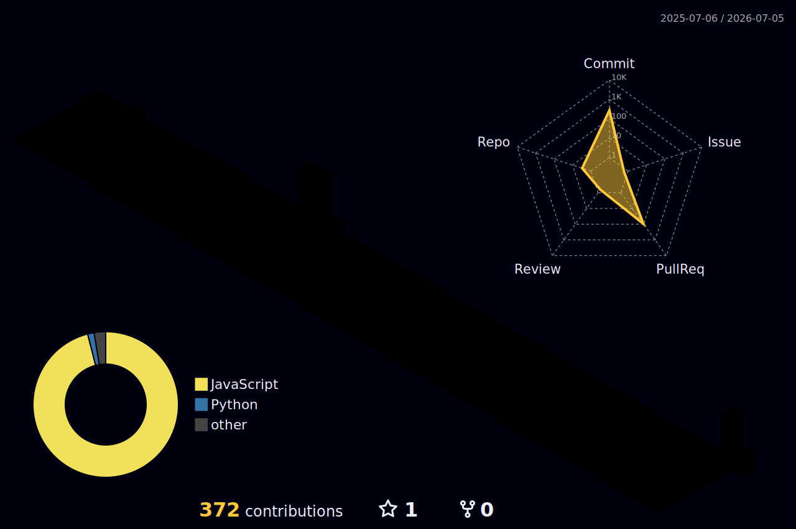

<!-- ════════════════════════ HEADER ════════════════════════ -->

  

  

  

    
    
    
  

## 🙋‍♂️ About Me

I'm a **full-stack web developer (MERN)** who now works in **enterprise Identity & Access Management with SailPoint** — a mix that keeps me building products *and* securing the identities behind them.

- 💼 **Today:** IAM professional working hands-on with **SailPoint IdentityIQ** — identity governance, access certifications, day-to-day IAM operations
- 🌱 **Learning:** going deeper into **IdentityIQ** and enterprise IAM architecture
- 🛠️ **Building:** MERN-stack side projects, iterated a little every day
- 🧠 **Practicing:** daily **DSA** in **Java & Python**
- 🎓 **Education:** BE in Computer Science — DYPCOE Akurdi, Pune
- ⚡ **Off-keyboard:** Badminton, TT, anime & comics, trading, gaming
- 📬 **Reach me:** [tej.pawar04@gmail.com](mailto:tej.pawar04@gmail.com)

## 🧰 Tech Stack

**Languages**

   

**Frontend**

   

**Backend & Databases**

   

**IAM & Security**

  

**Tools**

   

## 📌 Featured Work

My best projects live in the **pinned repositories** just below this README — each one is a hands-on MERN build. The full showcase, with live demos, is on my portfolio:

  

## 📊 GitHub Analytics

  
  
    
  
    
  
    
  

### 🧊 Contributions in 3D

  

### 🐍 Contribution Snake

  

## ✍️ Dev Quote

  

## 🤝 Connect With Me

  
  
  
    
  <i>Always happy to talk web dev, IAM, or a project idea — let's build something. 🚀</i>

<!-- ════════════════════════ FOOTER ════════════════════════ -->

