<!-- ═══════════════════════ SYNTHWAVE HERO ═══════════════════════ -->

  

  
  
  

 

<!-- ═══════════════════════ LIVE TERMINAL ═══════════════════════ -->

  

 

<!-- ═══════════════════════ ABOUT ME ═══════════════════════ -->

## 🧑‍🚀 About Me

- 💼 Working professionally in **Identity & Access Management** — hands-on with **SailPoint** in an enterprise environment
- 🌐 **MERN Stack Developer** — building responsive, dynamic web apps
- 📖 Currently deepening my skills in **SailPoint IdentityIQ** & enterprise IAM
- 💻 Daily **DSA practice** in **Java** & **Python** — consistency over intensity
- 🎓 BE Computer Science — DYPCOE Akurdi, Pune
- 🤝 Open to collaborating on innovative **web-based projects**
- 🎮 **Hobbies**: Building new things [tech & non-tech], Badminton, TT, Anime, Comics, Trading, Gaming

 

<!-- ═══════════════════════ SKILL MATRIX ═══════════════════════ -->
## 🛠️ Tech Arsenal

  

 

  

   
  
  
  

<!-- ═══════════════════════ GITHUB STATS ═══════════════════════ -->
## 📊 GitHub Analytics

  
  

  

  

  

<!-- ═══════════════════════ 3D CONTRIBUTIONS ═══════════════════════ -->
## 🧊 3D Contribution Graph

  

<!-- ═══════════════════════ SNAKE ═══════════════════════ -->

  

<!-- ═══════════════════════ CONNECT ═══════════════════════ -->
## 🤝 Let's Connect

  
  
  
  

 

  <i>✨ I believe in continuous learning and strive to turn ideas into impactful solutions. ✨</i>
    
  <b>Feel free to reach out for exciting opportunities or projects — let's build something amazing together! 🚀</b>

<!-- ═══════════════════════ FOOTER ═══════════════════════ -->

